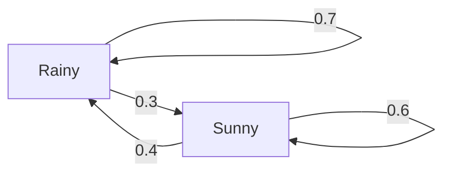

```markdown
# Decoding Problem

## 1. HMM解码问题定义

给定隐马尔可夫模型λ=(A,B,π)和观测序列O=(o₁,o₂,...,oₜ)，解码问题指寻找最可能的状态序列Q=(q₁,q₂,...,qₜ)，即：

$$
Q^* = \argmax_Q P(Q|O,\lambda)
$$

其中：
- A为状态转移矩阵
- B为观测概率矩阵
- π为初始状态分布

## 2. Viterbi算法原理

### 2.1 动态规划思想
Viterbi算法通过动态规划记录到达每个状态的最优路径概率：

$$
\delta_t(i) = \max_{q_1,...,q_{t-1}} P(q_1,...,q_t=i,o_1,...,o_t|\lambda)
$$

### 2.2 算法步骤

#### 初始化 (t=1):
```python
delta = np.zeros((T, N))  # T:时间步长, N:状态数
psi = np.zeros((T, N), dtype=int)

for i in range(N):
    delta[0][i] = pi[i] * B[i][obs[0]]
    psi[0][i] = 0
```

#### 递推 (t=2,...,T):
```python
for t in range(1, T):
    for j in range(N):
        max_prob = -1
        max_state = 0
        for i in range(N):
            prob = delta[t-1][i] * A[i][j] * B[j][obs[t]]
            if prob > max_prob:
                max_prob = prob
                max_state = i
        delta[t][j] = max_prob
        psi[t][j] = max_state
```

#### 终止与路径回溯:
```python
path = [0] * T
path[T-1] = np.argmax(delta[T-1])

for t in range(T-2, -1, -1):
    path[t] = psi[t+1][path[t+1]]
```

### 2.3 可视化示例
观测序列："Rainy", "Sunny", "Sunny"

状态转移图：


计算过程表格：
| 时间步 | 状态 | δ值 | ψ回溯指针 |
|--------|------|-----|----------|
| 1      | Rainy | 0.6*0.1=0.06 | 0 |
| 1      | Sunny | 0.4*0.4=0.16 | 0 |
| 2      | Rainy | max(0.06*0.7*0.1, 0.16*0.4*0.1)=0.0064 | Sunny |
| 2      | Sunny | max(0.06*0.3*0.4, 0.16*0.6*0.4)=0.0384 | Sunny |
```

## 3. 复杂度分析

时间复杂度：O(T×N²)
- T: 观测序列长度
- N: 隐藏状态数量

空间复杂度：O(T×N)
- 存储δ和ψ矩阵

## 4. 章节结论

Viterbi算法通过动态规划高效解决了HMM的解码问题，其核心在于：
1. 利用最优子结构性质避免重复计算
2. 通过ψ矩阵实现路径回溯
3. 多项式时间复杂度使其适用于实际应用

该算法为统计语言模型中的序列标注任务（如词性标注）提供了理论基础，下一章将探讨HMM的参数学习问题。
```