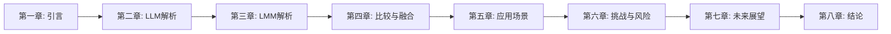

# 第一章：引言：大模型时代的崛起

在第一章中，我们回顾了大模型时代的崛起背景、核心动因及基本概念框架，为全文奠定了系统性基础。现在，我们将深入大型语言模型（LLM）的技术核心，这一章节至关重要，因为它不仅是理解当前人工智能浪潮的基石，更是解析LLM如何通过海量文本数据训练实现语言理解与生成的关键。本章将系统性地剖析LLM的架构设计、训练方法论以及性能优化策略，从而为后续对比多模态模型和探讨应用挑战提供坚实的技术支撑。接下来，我们将逐步展开子章节，详细探讨LLM的原理、演进与实例分析，引导读者从宏观背景转入微观技术细节。

## 背景与动因

人工智能的历程仿佛一场波澜壮阔的航海，历经符号主义的浅滩、统计学习的洋流，最终在深度学习的浪潮中驶向大模型时代的广阔海洋——这一切得益于几个关键催化剂的共同作用。回溯历史，人工智能的发展先后经历了三次主要浪潮。第一次浪潮（1950s-1980s）以**符号主义**为核心，其目标是让机器通过逻辑推理和规则系统来模拟人类智能，代表性成就包括早期的专家系统和逻辑证明器。然而，受限于计算能力和知识工程的复杂性，符号主义系统难以处理现实世界的模糊性和不确定性，最终陷入第一次AI寒冬。第二次浪潮（1980s-1990s）转向**统计学习**，研究者们开始利用概率模型和大量数据从样本中学习规律，支持向量机（SVM）和隐马尔可夫模型（HMM）等算法成为主流。尽管统计学习方法在语音识别和机器翻译等领域取得了初步成功，但其特征工程严重依赖人工设计，且模型表达能力有限。直到第三次浪潮——**深度学习**的兴起，神经网络尤其是深度神经网络（DNN）的潜力被重新发掘，其通过多层非线性变换自动学习数据的层次化特征表示，在图像识别、自然语言处理等领域实现了突破性进展。深度学习的成功为后续大模型的诞生奠定了理论基础。

深度学习虽展现出强大潜力，但其真正引爆点源于2017年Transformer架构的革命性突破。在Transformer之前，序列建模主要依赖循环神经网络（RNN）及其变体（如LSTM），这些模型存在长程依赖问题（long-range dependencies）和训练效率低下的瓶颈。Transformer架构的核心创新在于**自注意力机制（Self-Attention Mechanism）**，该机制彻底摒弃了递归结构，允许模型并行处理序列中的所有元素，并动态计算每个元素与其他元素之间的相关性权重。具体而言，自注意力机制通过三组向量——Query（查询）、Key（键）和Value（值）——来实现这一过程：Query代表当前需要关注的元素，Key用于与Query计算相似度（通过点积操作），而Value则包含每个元素的实际信息内容。通过Softmax(QK^T/√d_k)计算注意力权重并对Value进行加权求和，模型能够高效捕捉全局上下文信息。这一设计不仅大幅提升了训练速度（得益于并行化），还显著增强了模型对长序列的建模能力。Transformer的开山论文《Attention Is All You Need》（Vaswani et al., 2017）迅速成为自然语言处理领域的基石，为后续大型语言模型（LLM）的涌现提供了核心架构支持。

然而，仅凭算法创新不足以支撑参数规模达千亿级别的大模型训练。算力的指数级增长充当了关键的“引擎”角色。根据OpenAI的分析，自2012年以来，训练最大AI模型所需的计算量每3.4个月翻一番，这一速度远超摩尔定律。这一趋势主要由GPU（图形处理器）和TPU（张量处理器）等专用硬件的演进驱动。以英伟达的DGX系列为例，其最新一代H100 GPU的单精度浮点算力（FP32）已达到67 TFLOPS，整型算力（INT8）高达3958 TOPS，相比前代产品实现了数量级的提升。谷歌的TPU v4芯片则进一步优化了矩阵运算效率，专为神经网络训练中的大规模张量操作设计。这些高性能计算集群通过并行处理和海量内存带宽，使得训练包含数百甚至数千亿参数的模型从理论变为现实。例如，训练GPT-3（1750亿参数）需消耗约3.14×10^23次浮点运算，相当于使用1000块V100 GPU连续运行数周——没有强大的算力基础，此类模型根本无法实现。

“引擎”需要“燃料”才能运转，而大数据正是大模型训练的命脉。互联网的普及催生了前所未有的数据可用性。文本领域，Common Crawl项目每月抓取的网页文本达数十TB，涵盖多语言和多样化内容；Wikipedia、Reddit和图书语料库等高质量文本资源为模型提供了结构化知识。多模态数据同样蓬勃发展：ImageNet拥有超过1400万张标注图像，COCO数据集提供丰富的图像-文本对，而YouTube等平台则蕴含海量视频-音频-文本多元数据。这些数据集不仅规模庞大，且覆盖范围极广，使模型能够学习到世界知识的复杂分布。数据质量的提升同样关键——通过精心设计的清洗和过滤流程（如删除重复、低质量或有害内容），研究者能够构建更高效的训练语料，从而提升模型性能。

最终，大模型时代的崛起是Transformer架构、算力增长与大数据三要素协同作用的结果，形成了一场技术“完美风暴”。Transformer提供了高效的模型架构，使参数规模扩展成为可能；算力增长为训练这些庞大模型提供了物理基础；而大数据则确保了模型能够从充足且多样化的信息中学习。三者缺一不可：若没有Transformer，现有算力无法高效训练超长序列模型；若没有算力，再优秀的算法也只能纸上谈兵；若没有大数据，模型将陷入“巧妇难为无米之炊”的困境。这种协同效应催生了GPT、BERT等大型语言模型（LLM）的突破，并进一步推动模型从纯文本向视觉、音频等多模态领域扩展，最终孕育出大型多模态模型（LMM）。

## 核心概念界定

在大模型时代席卷全球的背景下，理解其核心构建块——大型语言模型（LLM）和大型多模态模型（LMM）——是把握技术浪潮的第一步。大型语言模型（LLM）是一种基于海量文本数据训练的生成式人工智能模型，其核心能力包括文本生成、理解、推理和翻译等。类比来说，LLM 就像一个超级智能的文本预测器，它通过分析统计模式来模拟人类语言专家，但并非真正理解语义。LLM 的训练通常分为两个阶段：预训练（在大规模文本语料上学习语言模式）和微调（针对特定任务进行优化），其底层架构多基于 Transformer，尤其是自注意力机制，使其能高效处理长序列依赖关系（Vaswani et al., 2017）。

代表性的 LLM 包括 OpenAI 开发的 GPT-4，它以强大的文本生成和推理能力著称，广泛应用于聊天机器人和内容创作（OpenAI, 2023）；Meta 推出的 Llama 2，作为开源模型，强调透明度和可定制性，参数规模达千亿级（Meta, 2023）；以及 Google 的 PaLM 2，专注于多语言理解和代码生成，优化了企业级应用（Google, 2023）。这些模型通过规模化的参数和数据，展现了 LLM 在文本领域的统治力。

大型多模态模型（LMM）则进一步扩展了 LLM 的能力，支持多种输入和输出模态，如文本、图像、音频和视频。LMM 的核心特征在于其多模态融合技术，例如通过视觉-语言对齐机制，将不同模态的数据映射到统一表示空间，从而实现跨模态的理解和生成。类比而言，LMM 就像一个能理解和生成多种媒体类型的大脑，类似于人类的多感官处理系统，它不仅能处理文本，还能整合视觉和听觉信息。

著名的 LMM 例子包括 OpenAI 的 CLIP，它通过对比学习实现图像-文本匹配，用于零样本分类和检索（Radford et al., 2021）；DALL-E 3，专注于文本到图像生成，允许用户通过自然语言描述创建高质量图像（OpenAI, 2023）；以及 GPT-4V（Vision），支持图像输入并生成文本响应，例如用户上传图片后，模型能描述内容或回答问题（OpenAI, 2023）。这些模型的应用场景广泛，如智能助手、创意设计和多模态搜索，体现了 LMM 的实用性。

初步对比 LLM 和 LMM，关键差异在于：LLM 以文本为中心，输入和输出均为文本，训练数据主要为文本语料，应用领域限于语言相关任务；而 LMM 支持多模态输入输出（如文本、图像、音频），训练数据包含多种模态，应用更广泛，包括视觉问答和多媒体生成。本质上，LMM 是 LLM 的多模态扩展，两者共享底层架构但 LMM 引入了额外的融合模块。

明确了 LLM 和 LMM 的基本概念后，我们将进一步概述本文的目标与结构，为后续深入解析奠定基础。

## 文章目标与结构

随着大模型技术重塑人工智能 landscape，本文旨在为读者提供一份系统而深入的路线图，解析LLM与LMM的核心、比较与应用，从而 navigate 这个快速变化的领域。具体而言，本文的目标是充当一份综合指南，通过拆解大型语言模型（LLM）和大型多模态模型（LMM）的技术原理、对比差异、分析应用场景与挑战，并展望未来发展方向，为读者提供全面而系统的洞察。这一目标基于对当前AI领域快速演进的深刻理解，例如LLM如ChatGPT专注于文本处理，而LMM如Google的Gemini或OpenAI的CLIP模型则整合文本、图像、音频等多模态数据，从而拓展AI的能力边界（引用来源：OpenAI的CLIP论文和Google的Gemini报告）。本文的全面性体现在它不仅覆盖技术细节，还涉及产业应用、伦理风险和社会影响，确保读者能从多维度理解大模型时代。

为了达成这一目标，本文的结构经过精心设计，遵循从基础到应用再到未来的逻辑流程。具体章节安排如下：首先，第二章深入解析LLM的技术原理，包括其架构、训练方法和演进历程；然后，第三章探讨LMM的技术突破，例如多模态融合机制和代表性模型；接着，第四章比较LLM与LMM的差异，并分析融合趋势；第五章分析应用场景，涵盖教育、医疗、娱乐等产业落地案例；第六章讨论挑战与风险，包括技术瓶颈、伦理问题和社会影响；第七章展望未来趋势与突破方向；最后第八章总结全文，强调负责任的大模型时代。以下流程图直观展示了这一结构演进：

这种结构背后的逻辑演进类似于建造一座房子：我们从打地基开始（技术解析，即第二和第三章），确保读者掌握核心原理；然后搭建框架（比较与融合，第四章），建立模型间的关联；再进行装修（应用落地，第五章），使技术具象化到现实场景；最后考虑维护和升级（挑战与未来，第六和第七章）， addressing 长期可持续性问题。这种逐步深入的方式确保内容连贯且易于理解，避免信息过载，同时保持权威性和可读性。

本文的价值在于其多受众适用性：对于AI研究者和开发者，它提供深度的技术解析和前沿趋势；对于企业决策者，它揭示产业机会和落地策略，帮助做出 informed decisions；对于技术爱好者和公众，它增进对AI伦理和社会影响的理解，促进负责任创新。例如，企业领袖可通过应用场景章节识别商业机会，而研究者则能从技术比较中获得灵感。总之，本文旨在成为大模型领域的权威参考，帮助各方在快速变化中保持领先。

在明确了本文的目标与结构后，我们将首先深入大型语言模型（LLM）的技术核心，从第二章开始详细解析其原理与演进。

综上所述，本章作为全篇的基石，系统回顾了人工智能从符号主义、统计学习到深度学习的演进历程，深入剖析了大模型时代崛起的三大核心驱动力——Transformer架构的革命性突破、算力的指数级增长以及大数据的海量积累，并清晰界定了大型语言模型（LLM）与大型多模态模型（LMM）的技术内涵与差异。通过对文章目标与结构的概述，我们不仅确立了权威而系统的分析框架，还为读者提供了 navigate 这一复杂领域的清晰路线图。本章的铺垫至此完成，接下来我们将深入第二章，聚焦于大型语言模型（LLM）的技术内核，开启对其架构、训练与演进的细致解析。